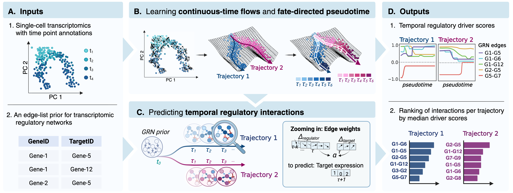

# TEMPO
Identifying temporal regulatory interactions driving cell state trajectories

## Installation
We recommend setting up a virtual environment through `conda` via `conda env create -f environment.yml` or setting up a Python virtual environment and installing dependencies listed in `requirements.txt` via pip. 
